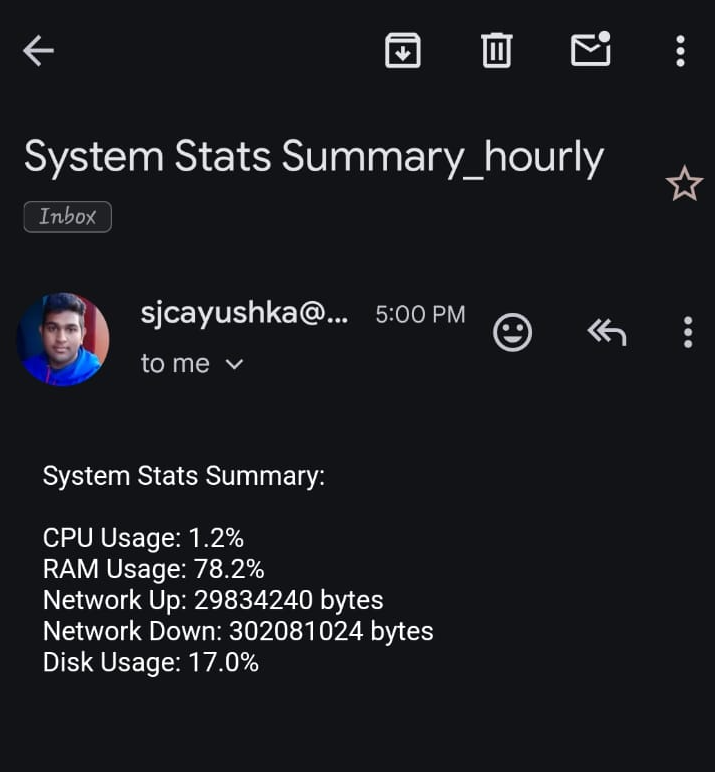
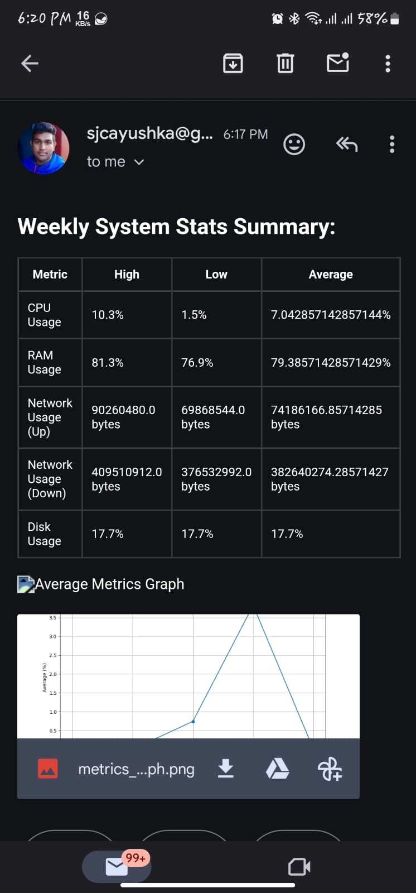

# System Monitoring and Data Flow Using AWS

This repository contains scripts and configurations to set up system monitoring, data collection, and data flow using AWS services.

## Overview

The system setup involves monitoring critical stats of an EC2 instance, collecting data using a Python script, uploading JSON files to an S3 bucket, and storing data in DynamoDB. Additionally, it includes setting thresholds, sending notifications.


## Enterprise Architecture Diagram 


--------------------------------------


## 1. monitor the Utilization of 5 Critical Environment/Host Stats in a EC2/Physical Unix Setup.
### Requirments
Identify the 5 critical environment/host stats to monitor.
Develop a monitoring solution using free softwares that can gather and display these stats.
### Step to take
1. Create a EC2 instace in the aws dashboard 
2. install aws cloud watch client application on the ec2 instace by using the following 
```
sudo yum install amazon-cloudwatch-agent
```
<a href="https://docs.aws.amazon.com/AmazonCloudWatch/latest/monitoring/install-CloudWatch-Agent-on-EC2-Instance.html"> Documentation</a>
-----------------------------------------

## Set Thresholds to Each of these 5 Critical stats at 60% - Amber and 80% Red
### Requirments
1. Define threshold levels for each critical stat (CPU, memory, disk, network, and response time).
2. Establish different threshold colors (amber and red) for warning and critical levels.

### steps to take 
1. In the CloudWatch dashboard, select "Metrics" from the sidebar menu.
2. Choose the metric namespace related to your EC2 instances or Unix hosts (e.g., EC2, System/Linux, etc.).
3. Select the specific metric(s) you want to monitor, such as CPUUtilization, MemoryUtilization, DiskReadBytes DiskWriteBytes, NetworkIn, NetworkOut, etc.
4. Click on the metric to view its graph and details.
5. From the left sidebar in CloudWatch, click on "Alarms" under the "Alarms & Events" section.
6. Click on the "Create Alarm" button
7. Define the statistic and period for evaluating the metric.
8. Set conditions for your alarm:
9. Configure actions for your alarm:
10. Provide a name and description for your alarm.
11. Repeat the same for the other monitoring metrics


-----------------------------------------

## 2. Setup a mechanism for each of the Critical Stat thresholds to be tested and 
### Requirments
1. Implement an automated system to test
2. Configure the monitoring tool to set thresholds for each metric.
3. Set the threshold levels at 60% for amber and 80% for red.
4. Ensure that alerts or notifications are triggered when thresholds are exceeded.


### Step to take
1. install the stress tool on your EC2 instance
```
sudo yum install stress
```
```pip3 install psutil```

2. download the following Python script.
   
   <a href="/Scripts/Logs V2.py"> StessTest.py <a>

3. On the EC2 terminal create a new file in the root
    ``` 
    Touch StressTest.py  
    ```
    
4. Edit the file and add the content from the logsV2py file using the following command 
    ```
    Vim StressTest.py
    ```
    
5. Save and exit (press button esc and)
    ```
    :wq
    ```
6. Run the following command to make the app run indefinitely on the background
    ```
    python3 StressTest.py
    ```

8. Kill the program after a few mins 


## 3. upon each violation of the threshold an email to be sent out
### Requirments
1. Recive emails for a selected group based on the seviraty level

### Step to take
Navigate to the cloudwatch
Select Alarms and then Create Alarm
Scroll through the Amazon SNS metrics to find the metric you want to alarm on
Define a threshold *80% and 60%) value to trigger the alarm
Under Notification, select an existing or new Amazon SNS topic
Enter a name for the alarm
Review the configuration and select Create Alarm 

Sample email :
<br>

<br>


-----------------------------------------

## 4. Record the 5 Key stats every minute and record the data in a JSON Type Document which can be fed into a database
### Requirments
1. Write a script to collect system stats and upload JSON files to S3 
2. at the same time add them to a log folder and every 7 days remove them.
4. Collect logs in json and send it to the s3 bucket

### Step to take
1. Using SSH connect to the terminal 
2. Install the following dependencies
```
# Update package list and install pip and AWS CLI
sudo yum update -y
sudo yum install python -y
sudo curl -O https://bootstrap.pypa.io/get-pip.py
python3 get-pip.py --user
pip install boto3
sudo yum install -y python3-pip awscli

# Create a directory for your project
mkdir -p /home/ec2-user/Monitoring
cd /home/ec2-user/Monitoring
```
    
3. configure aws by using the following and entering the information requesteed 
```
aws configure
```
4. Download the files on the s3 bucket
```
# Download files from S3
aws s3 cp s3://python-storage-bin-asia/WeeklyEmail.py .
aws s3 cp s3://python-storage-bin-asia/requirements.txt .
aws s3 cp s3://python-storage-bin-asia/Logs\ V2.py .
aws s3 cp s3://python-storage-bin-asia/Hourly\ emails.py .

# Install the Python dependencies
pip3 install -r requirements.txt
```

5. Run the following command to make the app run indefinitely on the background
    ```
    nohup python Logs\ V2.py &
    ```

    This will send log files for 5 mins and it will run indefenetly until the instace reboots

-----------------------------------------

## 5. Send a Weekly Summary email to an email address with Weekly High, low and Average values in a tabular format.
### Requirments
1. generate a report with a weekly information
2. Generate the information in a table format
3. send the email to a group of people 

### Steps to take
1. since we downloaded the files required on the previous step we are goin to add this to a crontab tp schedule the scripts
    ```
    crontab -e
    ```
2. edit the file and add the following file save and exit
    ```
    ┌─-──────────── Minute (0-59)
    │ ┌───────────── Hour (0-23)
    │ │ ┌───────────── Day of the Month (1-31)
    │ │ │ ┌───────────── Month (1-12 or Jan-Dec)
    │ │ │ │ ┌───────────── Day of the Week (0-7, both 0 and 7 represent Sunday)
    │ │ │ │ │     
    * * * * * /usr/bin/python /home/ec2-user/WeeklyEmail.py
    * * * * * /usr/bin/python /home/ec2-user/Hourly\ emails.py
    ```
3. verify the cron job queue using following 
    ```
    crontab -l
    ```
Sample email :
<br>


Sample weekly email:
<br>

-----------------------------------------

## 6. Implement Error Logging to the Solution where any errors will be managed and notified to various stakeholders
### Requirments

***Will be completed in a future

-----------------------------------------
