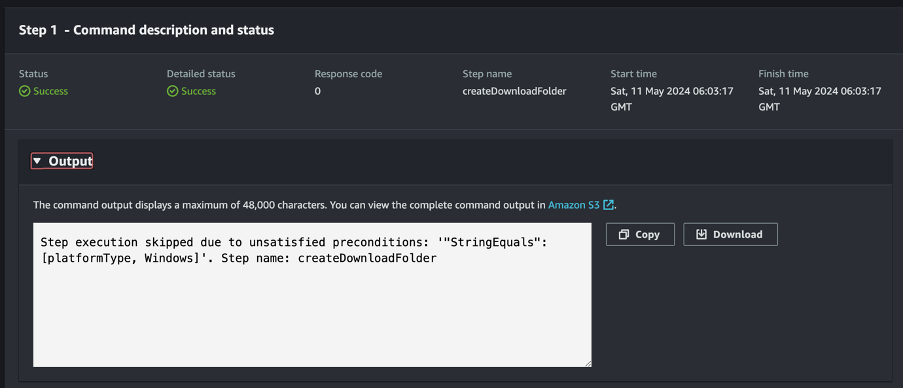

# L2 Technical support agent

# System Monitoring and Data Flow Using AWS

This repository contains scripts and configurations to set up system monitoring, data collection, and data flow using AWS services.

## Overview

The system setup involves monitoring critical stats of an EC2 instance, collecting data using a Python script, uploading JSON files to an S3 bucket, and storing data in DynamoDB. Additionally, it includes setting thresholds, sending notifications.


## Setup Instructions

### Step 1: EC2 Instance Setup
1. Launch an EC2 instance with Python installed.
2. Ensure the instance has necessary permissions for S3 and DynamoDB access.

### Step 2: Python Script and S3 Upload
1. Write a Python script to collect system stats and upload JSON files to S3.
2. Use Boto3 to interact with AWS services in the script.
3. Collect logs in json and send it to the s3 bucket

4. Using SSH connect to the terminal 
5. Install the following dependencies
```
    pip3 install psutil
```
```
    pip3 install boto3
```
```
    pip3 install pytz
```

7. download the following Python script.
   
   <a href="/Python Scripts/Logs V2.py"> logsV2.py <a>
   

9. On the EC2 terminal create a new file in the root
    ```
    Touch monitor.py
    ```
    
11. Edit the file and add the content from the logsV2py file using the following command 
    ```
    Vim monitor.py
    ```
    
12. Save and exit (press button esc and)
    ```
    :wq
    ```
    

14. Run the following command to make the app run indefinitely on the background
    ```
    nohup python monitor.py &
    ```

### Step 3: S3 Event Trigger and Lambda Function
1. Set up an S3 event trigger to invoke a Lambda function on file upload.
2. Create a Lambda function to read JSON files from S3 and store data in DynamoDB.



### Step 4: Thresholds, Alarms, and Notifications
1. Configure CloudWatch alarms for critical stats with thresholds.
2. Set actions for alarms to trigger Lambda functions for email notifications.

### Step 5: Weekly Summary Email
1. Create a Lambda function to calculate weekly high, low, and average values.
2. Use SES to send a weekly summary email with the calculated data.

### Step 6: Error Logging and Handling
1. Utilize CloudWatch Logs to capture errors from Lambda functions.
2. Set up alarms for critical errors and handle them appropriately.


### Step 7: Configuration Flexibility
1. Store configurable parameters in AWS Parameter Store or Secrets Manager.
2. Ensure easy updates without code changes for thresholds, email addresses, etc.


## Credits
