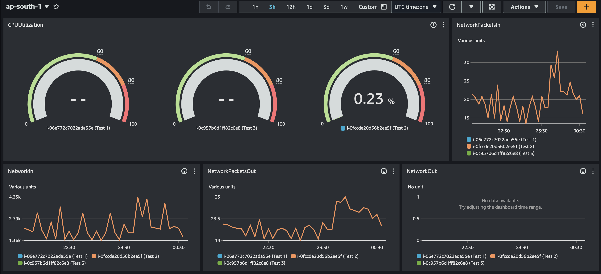

# System Monitoring and Data Flow Using AWS

This repository contains scripts and configurations to set up system monitoring, data collection, and data flow using AWS services.

## Overview

The system setup involves monitoring critical stats of an EC2 instance, collecting data using a Python script, uploading JSON files to an S3 bucket, and storing data in DynamoDB. Additionally, it includes setting thresholds, sending notifications.



## Enterprise Architecture Diagram 


--------------------------------------


## 1. monitor the Utilization of 5 Critical Environment/Host Stats in a EC2/Physical Unix Setup.
### Requirments
Identify the 5 critical environment/host stats to monitor.
Develop a monitoring solution using free softwares that can gather and display these stats.
### Step to take
1. Create a EC2 instace in the aws dashboard 
2. install aws cloud watch client application on the ec2 instace by using the following 
```
sudo yum install amazon-cloudwatch-agent
```
<a href="https://docs.aws.amazon.com/AmazonCloudWatch/latest/monitoring/install-CloudWatch-Agent-on-EC2-Instance.html"> Documentation</a>
-----------------------------------------

## Set Thresholds to Each of these 5 Critical stats at 60% - Amber and 80% Red
### Requirments
1. Define threshold levels for each critical stat (CPU, memory, disk, network, and response time).
2. Establish different threshold colors (amber and red) for warning and critical levels.

### steps to take 
1. In the CloudWatch dashboard, select "Metrics" from the sidebar menu.
2. Choose the metric namespace related to your EC2 instances or Unix hosts (e.g., EC2, System/Linux, etc.).
3. Select the specific metric(s) you want to monitor, such as CPUUtilization, MemoryUtilization, DiskReadBytes DiskWriteBytes, NetworkIn, NetworkOut, etc.
4. Click on the metric to view its graph and details.
5. From the left sidebar in CloudWatch, click on "Alarms" under the "Alarms & Events" section.
6. Click on the "Create Alarm" button
7. Define the statistic and period for evaluating the metric.
8. Set conditions for your alarm:
9. Configure actions for your alarm:
10. Provide a name and description for your alarm.
11. Repeat the same for the other monitoring metrics


-----------------------------------------

## 2. Setup a mechanism for each of the Critical Stat thresholds to be tested and 
### Requirments
1. Implement an automated system to test
2. Configure the monitoring tool to set thresholds for each metric.
3. Set the threshold levels at 60% for amber and 80% for red.
4. Ensure that alerts or notifications are triggered when thresholds are exceeded.


### Step to take
1. install the stress tool on your EC2 instance
```
sudo yum install stress
```
```pip3 install psutil```

2. download the following Python script.
   
   <a href="/Python Scripts/Logs V2.py"> StessTest.py <a>

3. On the EC2 terminal create a new file in the root
    ``` 
    Touch StressTest.py  
    ```
    
4. Edit the file and add the content from the logsV2py file using the following command 
    ```
    Vim StressTest.py
    ```
    
5. Save and exit (press button esc and)
    ```
    :wq
    ```
6. Run the following command to make the app run indefinitely on the background
    ```
    python3 StressTest.py
    ```

8. Kill the program after a few mins 


## 3. upon each violation of the threshold an email to be sent out
### Requirments
1. Recive emails for a selected group based on the seviraty level

### Step to take
Navigate to the cloudwatch
Select Alarms and then Create Alarm
Scroll through the Amazon SNS metrics to find the metric you want to alarm on
Define a threshold *80% and 60%) value to trigger the alarm
Under Notification, select an existing or new Amazon SNS topic
Enter a name for the alarm
Review the configuration and select Create Alarm 

Sample email :
<br>

<br>


-----------------------------------------

## 4. Record the 5 Key stats every minute and record the data in a JSON Type Document which can be fed into a database
### Requirments
1. Write a script to collect system stats and upload JSON files to S3 
2. at the same time add them to a log folder and every 7 days remove them.
4. Collect logs in json and send it to the s3 bucket

### Step to take
1. Using SSH connect to the terminal 
2. Install the following dependencies
```
    pip3 install psutil
```
```
    pip3 install boto3
```
```
    pip3 install pytz
```

3. download the following Python script.
   
   <a href="/Python Scripts/Logs V2.py"> logsV2.py <a>
   

4. On the EC2 terminal create a new file in the root
    ``` 
    Touch monitor.py  
    ```
    
5. Edit the file and add the content from the logsV2py file using the following command 
    ```
    Vim monitor.py
    ```
    
6. Save and exit (press button esc and)
    ```
    :wq
    ```
    

7. Run the following command to make the app run indefinitely on the background
    ```
    nohup python monitor.py &
    ```

8. Create a new lambda funtion add a name  so that whennever the data is sent to the s3 bucket send it to the dynamodb 
* by using a database it will be easy to get the min max values for a period wich will be helpful in the latterpart 

9. Lambda Function for DynamoDB:
    Create a Lambda function using Python(version 3.8).
    Configure this Lambda function to be triggered by the S3 event.
    Use Boto3 in the Lambda function to read the JSON file from S3 and write the data to DynamoDB (SystemData in your case) using the put_item API.
    Here's the python code for the Lambda function

    <a href="/Python Scripts/S3-To_dynamoDB-Json.PY">  <a>
-----------------------------------------

## 5. Send a Weekly Summary email to an email address with Weekly High, low and Average values in a tabular format.
### Requirments
1. generate a report with a weekly information
2. Generate the information in a table format
3. send the email to a group of people 

### Steps to take
1. install python libarary
```
pip3 install psutil schedule 
```

2. download the following Python script.
   
   <a href="/Python Scripts/Hourly emails.py"> Hourly emails.py <a>
   <a href="/Python Scripts/Weekly report.py"> Weekly emails.py <a>
   

3. On the EC2 terminal create a new file in the root
    ``` 
    Touch Hourly.py  
    ```
    ``` 
    Touch Weekly.py  
    ```
    
4. Edit the file and add the content from the python file using the following command 
    ```
    Vim file_name.py
    ```
    
5. Save and exit (press button esc and)
    ```
    :wq
    ```
6. using cron tab function to repeat the emails on a selected date/time
    ```
    crontab -e
    ```
7. edit the file and add the following file save and exit
    ```
    * * * * * /usr/bin/python /home/ec2-user/Hourly.py
    * * * * * /usr/bin/python /home/ec2-user/Weekly.py

    ```
8. verify the cron job queue using following 
    ```
    crontab -l
    ```

-----------------------------------------

## 6. Implement Error Logging to the Solution where any errors will be managed and notified to various stakeholders
### Requirments

***Will be completed in a future iteration

-----------------------------------------
